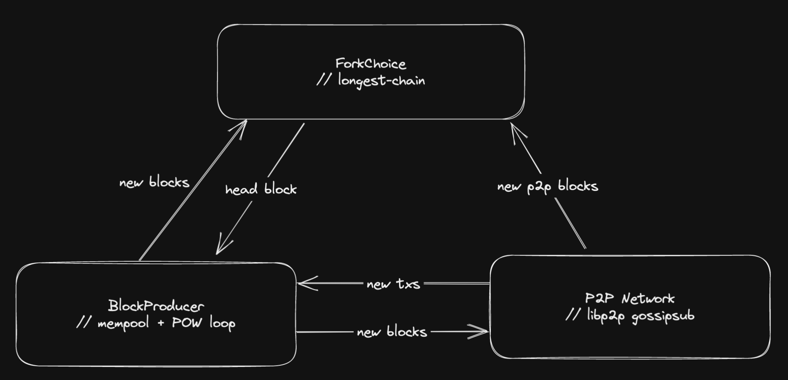

## mini-bchain 

a mini blockchain written in rust for learning purposes :)

## resources 
- how we manage chain state: [ETH State Managment](https://github.com/0xNineteen/blog.md/blob/master/contents/eth-state/index.md)

## files 
- `src/structures.rs`: defns of Accounts, Transactions, and Blocks
- `src/fork_choice.rs`: keeps track of the chain + its head
- `src/network.rs`: libp2p gossip 
- `src/pow.rs`: produces blocks by solving pow 
- `src/machine.rs`: state transition machine fcns (process txs to get new state)
- `src/db.rs`: manages chain state
- `src/rpc.rs`: manages the rpc api for the node
- `src/peer_manager.rs`: manages the peers connected through Mdns and stores their RPC client

- `bin/node.rs`: main node loop
- `bin/client.rs`: main client loop (sending txs)

## architecture 

### `BlockProducer` 
- `src/pow.rs`
  - grabs transactions from its mempool
  - gets head of chain from `ForkChoice`
  - processes them to get a new state (`src/machine.rs`)
  - do POW loop until block is solved 
    - if solved send block to `ForkChoice` to update chain/head and `P2P` to gossip to other nodes
    - periodically check `ForkChoice` for a new head

### `ForkChoice` 
- `src/fork_choice.rs`
  - keeps track of the head of the chain 
  - gets new blocks from pow and p2p network 

### `P2P Network` 
- `src/network.rs`
  - sets up gossip sub using libp2p 
  - listens for new txs and blocks from the network 
    - on new tx: send to `BlockProducer` to save in mempool
    - on new block: send to `ForkChoice` to update chain/head

